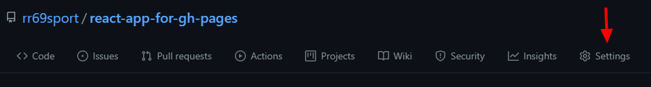
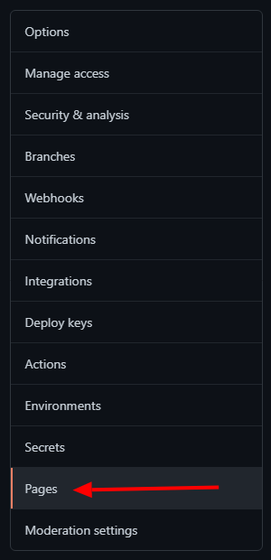

# Subir un proyecto de React a GitHub Pages

Este proyecto está creado con [Create React App](https://github.com/facebook/create-react-app) y [gh-pages](https://github.com/tschaub/gh-pages) - [link del deploy aquí](https://rr69sport.github.io/react-app-for-gh-pages/)

## Primeros pasos

Con el proyecto de react ya creado, instalamos [gh-pages](https://github.com/tschaub/gh-pages) como dependencia de desarrollo `npm install gh-pages --save-dev` ó `npm i gh-pages -D`.

En el `package.json`, necesitamos definir al principio del archivo la propiedad `"homepage"` con el valor `"./"`, quedando tal que así: 

```json
{
    "homepage": "./",
    //...
}
```

Para continuar debemos definir en la sección `"scripts"` del `package.json` también, lo siguiente:

```json
"scripts": {
    //...
    "predeploy": "npm run build",
    "deploy": "gh-pages -d build"
}
```

> Pueden ir al último o al principio.

## En GitHub

`create-react-app` ya nos inicializa un proyecto de git así que no tenemos que iniciarlo, pero sí tenemos que decirle a donde lo va a subir, para eso usamos el comando de git: `git remote add origin https://github.com/{tu-usuraio}/{nombre-del-repo}.git`

Ahora ejecutamos en comando: `npm run deploy` que habíamos establecido antes en los `scripts` del `package.json`.

Por último ya nos queda subir el proyecto a github:

```bash
git add .
git commit -m "Tu mensaje de commit"
git push -u origin main
```

Hecho esto ya está nuestro proyecto de react en GitHub Pages! Para ver el link debemos ir a nuestro repo del proyecto, a la sección `Settings` y ahí entrar a la sección `Pages` y veremos nuestro link de la app publicada!





Tener en cuenta que GitHub puede demorar en actualizar los cambios en la página del link. Solo es esperar un ratito y listo!!
